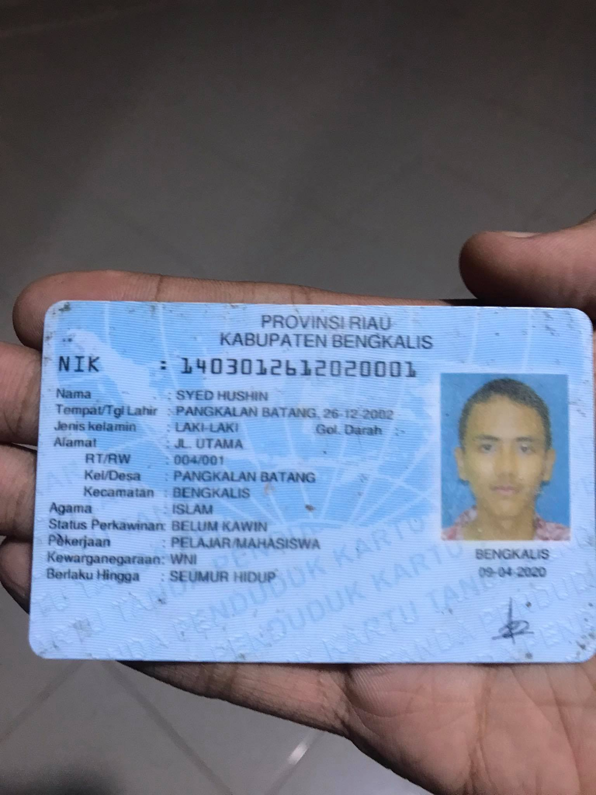

<div align="center">
  
  <h1>⚡ Flashcom - Service Management App</h1>
  <p>Aplikasi Modern Pencatatan & Monitoring Servis Perangkat IT untuk Instansi</p>

  <!-- Badges -->
  <p>
    
    
    
  </p>
  <p>
    
    
  </p>
</div>

---

## 📖 Tentang Aplikasi
**Flashcom** adalah aplikasi *mobile* ringkas nan elegan untuk mengelola daftar perbaikan perangkat keras (seperti Laptop, Printer, CCTV, dll) milik antrian berbagai **Instansi/Pelanggan**. 

Aplikasi ini dapat dioperasikan secara **Luring (Offline First)** menggunakan penyimpanan perangkat, namun juga mendukung **Sinkronisasi Langsung ke Google Sheets** agar data dapat secara simultan dikelola oleh staf lain melalui komputer Desktop.

<div align="center">
  
  &nbsp;&nbsp;&nbsp;&nbsp;
  
  &nbsp;&nbsp;&nbsp;&nbsp;
  
  <br/>
  *(Tangkapan Layar Aplikasi)*
</div>

## ✨ Fitur Utama
1. **Pencatatan Cepat Lintas Instansi** - Mendata perangkat baru dalam hitungan detik (Tipe Barang, Tanggal Masuk, Ruangan, Keterangan).
2. **Dashboard & Ringkasan Cerdas** - Antarmuka modern yang menampilkan hitungan *badges* servis: Masuk, Selesai, dan Tertunda.
3. **Penyimpanan Lokal Persisten** - Tidak perlu koneksi internet untuk mengelola pencatatan harian berkat `AsyncStorage`.
4. **Google Sheets API Sync (Otomatis & Real-Time)** - Sekali atur, aplikasi akan menyinkronkan data lokal ke *Google Drive* kamu atau menarik pembaruan tabel secara otomatis di latar belakang.
5. **Ekspor Laporan (PDF & Excel)** - Ubah rekapitulasi data Instansi menjadi laporan `.pdf` yang rapi atau `.xlsx` (*Excel*) berformat tabel profesional, lalu bagikan lewat WhatsApp atau Email langsung dari ponsel.

## 🛠️ Tech Stack
- **Framework Utama:** [React Native](https://reactnative.dev/) (dengan ekosistem [Expo](https://expo.dev/))
- **Bahasa:** TypeScript / JavaScript
- **Penyimpanan Lokal:** `@react-native-async-storage/async-storage`
- **Routing:** Expo Router (File-based routing)
- **Ekspor Berkas:** `expo-print` (PDF), `xlsx` (Excel), `expo-file-system`, `expo-sharing`
- **Tampilan CSS:** Stylesheet murni bergaya modern-minimalis.

## 🚀 Cara Mulai (Development)

Jika kamu ingin menjalankan kode sumber lokal ke komputermu:

1. **Clone Repositori ini:**
   ```bash
   git clone https://github.com/Aldricc/ServisApp.git
   cd ServisApp
   ```

2. **Pasang Dependensi (NPM):**
   ```bash
   npm install
   ```

3. **Nyalakan Server Expo:**
   ```bash
   npx expo start
   ```
   > Pindai kode QR yang muncul dengan aplikasi **Expo Go** (Bagi Android & iOS).

## 📱 Build Production (APK Android)
Aplikasi ini sudah dikonfigurasi menggunakan **EAS Build** (Expo Application Services).
Kamu bisa mencetak keluaran file `.apk` secara gratis di komputermu dengan:

```bash
# Login akun Expo jika belum
npx eas-cli login

# Mulai pencetakan
eas build -p android --profile preview
```
Tunggu sekitar 5–10 menit, URL tautan untuk mengunduh `.apk` akan siap.

## ☁️ Setting Google Sheets API
Aplikasi membaca parameter `keteranganPerbaikan` dkk untuk dikirimkan secara fetch POST/GET.
1. Buat **Spreadsheet Baru** di Google Drive.
2. Buka *Extensions* -> *Apps Script*.
3. Salin kode konektor *doPost* & *doGet* ke dalam Editor, berikan otorisasi.
4. Klik **Deploy as Web App** (Set Akses ke `Anyone`).
5. Salin URL Web App yang dihasilkan.
6. Masukkan URL tersebut ke tab **Pengaturan** di Aplikasi Flashcom ini! Siap disinkronkan.

---

## 📜 Lisensi
Proyek ini dilisensikan di bawah **MIT License**. Jangan ragu untuk me- *fork* dan mengembangkan aplikasinya lebih lanjut!

---

<div align="center">
  Dibuat dengan ❤️ untuk mempermudah produktivitas Teknisi IT 🎧💻
</div>
